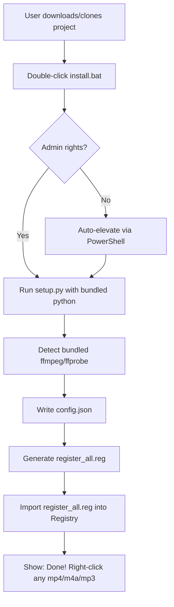

# Portable Installer Plan — Windows Right-Click MP4/MP3 Tools

## 1. Problem Analysis

The current project has **three critical dependencies** that prevent it from working on a fresh Windows system:

| Dependency | Status | Issue |
|---|---|---|
| **Python 3** | External | Must be pre-installed by user |
| **FFmpeg + FFprobe** | External | Must be downloaded, installed, and added to PATH |
| **Registry Paths** | Hardcoded | `install-all-tools.reg` contains paths from another user's system |

Additionally:
- [`add_music.bat`](add-music-to-mp3/add_music.bat) calls `ffprobe`/`ffmpeg` directly (not via `config.json`) → will fail if FFmpeg not in PATH
- No uninstall mechanism exists
- No portable "copy and run" capability

## 2. Proposed Solution: Portable Bundled Package

Bundled folder structure with **embedded Python** + **portable FFmpeg** + **auto-setup script**.

### 2.1. Directory Structure After Implementation

```
windows-rightclick-mp4-to-mp3/
├── ffmpeg/                          # NEW: bundled portable ffmpeg
│   ├── ffmpeg.exe
│   └── ffprobe.exe
├── python/                          # NEW: bundled embedded Python
│   ├── python.exe
│   ├── python3.dll
│   ├── python311.dll
│   └── Lib/ ...
├── convert-mp4-to-mp3/
│   └── convert_mp4_to_mp3.py
├── convert-m4a-to-mp3/
│   └── convert_m4a_to_mp3.py
├── convert-to-ogg/
│   └── convert_to_ogg.py
├── batch-convert/
│   └── batch_convert.py
├── split-mp4-middle/
│   └── split_middle_overlap.py
├── add-music-to-mp3/
│   ├── add_music.bat               # MODIFIED: use bundled ffmpeg
│   ├── start.mp3
│   ├── middle.mp3
│   └── finish.mp3
├── remove-silence-mp3/
│   ├── remove_silence.py
├── remove-long-silence-mp3/
│   ├── remove_long_silence.py
├── split-on-silence-mp3/
│   └── split_on_silence.py
├── _ffmpeg_config.py               # MODIFIED: detect bundled ffmpeg first
├── setup.py                         # MODIFIED: detect bundled python/ffmpeg
├── setup_win.bat                    # MODIFIED: use bundled python
├── install.bat                      # NEW: one-click installer
├── uninstall.bat                    # NEW: clean uninstaller
├── config.json                      # GENERATED: by setup.py with bundled paths
├── register_all.reg                 # GENERATED: by setup.py
└── context_menu.log
```

### 2.2. What Needs to Change

#### A. Bundle FFmpeg (Portable Build)
- Download the **FFmpeg Essentials build** from [`gyan.dev`](https://www.gyan.dev/ffmpeg/builds/) (or BtbN)
- Extract `ffmpeg.exe` and `ffprobe.exe` into a new [`ffmpeg/`](ffmpeg/) folder at project root
- File size: ~60 MB for full, ~15 MB for essentials

#### B. Bundle Embedded Python
- Download **Embedded Python** (`python-3.x.x-embed-amd64.zip`) from python.org
- Extract into a new [`python/`](python/) folder at project root
- Run `python._pth` to enable site-packages (uncomment `import site`)
- Install required packages into `python/Lib/site-packages/` (none needed currently — all use stdlib only ✓)
- File size: ~12 MB

#### C. Modify `_ffmpeg_config.py` to Prioritize Bundled FFmpeg
Currently [`_ffmpeg_config.py`](_ffmpeg_config.py:82) returns `ffmpeg` from `config.json` or falls back to PATH. We need to:
1. Check if [`ffmpeg/ffmpeg.exe`](ffmpeg/ffmpeg.exe) exists in the project root first
2. If yes, use the bundled version
3. Otherwise, fall back to `config.json` → PATH

```python
def get_ffmpeg():
    # Check bundled first
    bundled = _project_root() / "ffmpeg" / "ffmpeg.exe"
    if bundled.exists():
        return str(bundled)
    # Otherwise config.json or PATH
    c = _load_config()
    return c.get("ffmpeg") or "ffmpeg"
```

#### D. Modify `setup.py` to Auto-Detect Bundled Components
- Add auto-detection of [`python/python.exe`](python/python.exe) (bundled)
- Add auto-detection of [`ffmpeg/ffmpeg.exe`](ffmpeg/ffmpeg.exe) (bundled)
- Write `config.json` with paths to bundled exes
- Generate `register_all.reg` pointing to bundled python.exe

#### E. Create `install.bat` — One-Click Installer
This script does everything in one go:
1. **Check Admin rights** (needed for registry write) → auto-elevate via PowerShell
2. Run `setup_win.bat` (which now auto-detects bundled python/ffmpeg)
3. Auto-import `register_all.reg` via `reg import`
4. Optionally: add to Start Menu / Desktop shortcut
5. Show success message

#### F. Create `uninstall.bat` — Clean Uninstaller
1. Remove all registry keys that this project added (iterate over the same list as `setup.py`)
2. Optionally: delete the project folder (if desired)
3. Show completion message

#### G. Fix `add_music.bat` to Use Bundled FFmpeg
Currently it calls `ffprobe` and `ffmpeg` directly. Need to modify it to:
- Check if [`ffmpeg/ffmpeg.exe`](ffmpeg/ffmpeg.exe) exists next to the script
- If yes, use that path
- If not, fall back to `ffmpeg` from PATH

#### H. Fix `install-all-tools.reg` (remove hardcoded paths)
This file should be **deleted or regenerated** by `setup.py` — it should not be stored with hardcoded paths in version control. The `.gitignore` already ignores `register_all.reg`, so the fix is to:
- Remove or regenerate `install-all-tools.reg`
- Ensure `setup.py` is the sole source of registry generation

### 2.3. Installation Flow (for End User)



### 2.4. Files to Create/Modify

| File | Action | Description |
|---|---|---|
| [`ffmpeg/ffmpeg.exe`](ffmpeg/ffmpeg.exe) | **CREATE** (download) | Portable FFmpeg binary |
| [`ffmpeg/ffprobe.exe`](ffmpeg/ffprobe.exe) | **CREATE** (download) | Portable FFprobe binary |
| [`python/python.exe`](python/python.exe) | **CREATE** (download) | Embedded Python binary |
| [`install.bat`](install.bat) | **CREATE** | One-click installer script |
| [`uninstall.bat`](uninstall.bat) | **CREATE** | Clean uninstaller script |
| [`_ffmpeg_config.py`](_ffmpeg_config.py) | **MODIFY** | Add bundled ffmpeg detection |
| [`setup.py`](setup.py) | **MODIFY** | Auto-detect bundled python/ffmpeg |
| [`setup_win.bat`](setup_win.bat) | **MODIFY** | Use bundled python if available |
| [`add-music-to-mp3/add_music.bat`](add-music-to-mp3/add_music.bat) | **MODIFY** | Use bundled ffmpeg |
| [`install-all-tools.reg`](install-all-tools.reg) | **DELETE** or regenerate | Remove hardcoded paths |
| [`README.md`](README.md) | **MODIFY** | Update with new install instructions |

### 2.5. What Does NOT Change
- All Python scripts (`convert_mp4_to_mp3.py`, etc.) remain **unchanged** — they already use `get_ffmpeg()` and `get_ffprobe()` from `_ffmpeg_config.py`
- The `.reg` file generation logic in `setup.py` remains **unchanged**
- The `batch_convert.py` logic remains **unchanged**
- All feature directories keep their existing structure

### 2.6. Files to Download (for bundling)

We need to provide clear instructions or a download script for the binaries:

1. **FFmpeg (portable):** https://www.gyan.dev/ffmpeg/builds/ffmpeg-release-essentials.zip
   - Extract: `ffmpeg.exe`, `ffprobe.exe` → `ffmpeg/`
2. **Python (embedded):** https://www.python.org/ftp/python/3.11.9/python-3.11.9-embed-amd64.zip
   - Extract all → `python/`
   - Edit `python/python._pth`: uncomment `import site`

Alternatively: Create a [`download-deps.ps1`](download-deps.ps1) script that downloads and extracts these automatically.

## 3. Implementation Order

1. **Download & bundle FFmpeg** → `ffmpeg/ffmpeg.exe`, `ffmpeg/ffprobe.exe`
2. **Download & bundle Embedded Python** → `python/python.exe` + all files
3. **Modify `_ffmpeg_config.py`** → add bundled ffmpeg detection
4. **Modify `setup.py`** → auto-detect bundled python/ffmpeg
5. **Modify `setup_win.bat`** → use bundled python as priority
6. **Create `install.bat`** → one-click installer with admin elevation
7. **Create `uninstall.bat`** → clean removal
8. **Fix `add_music.bat`** → use bundled ffmpeg
9. **Clean up `install-all-tools.reg`** → remove or regenerate
10. **Update `README.md`** and docs
11. **Test on a fresh Windows system**
12. **Update `.gitignore`** to include bundled binaries (or keep them tracked?)

## 4. Open Questions for the User

1. **Python version**: Which embedded Python version to bundle? (3.11 is stable and small)
2. **FFmpeg build**: Essentials or Full? (Essentials is ~15MB, Full is ~60MB)
3. **Track binaries in Git?** (FFmpeg/Python EXEs are large — recommend download-deps script instead)
4. **Registry scope**: Current installation uses `HKEY_CLASSES_ROOT` (all users). Should we switch to `HKEY_CURRENT_USER` (current user only, no admin needed)?
